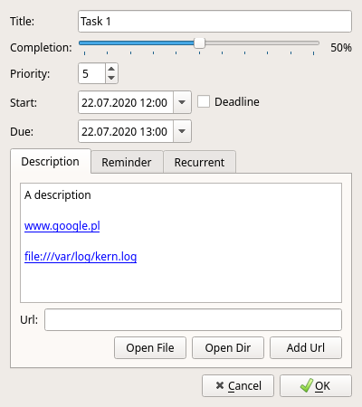
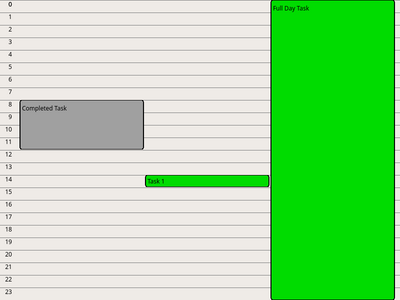

# Hanlendar

Handy Calendar -- calendar and todo list in one application allowing to organize date related tasks, priority todos and simple notes.

Main motivation to create the app was lack of satisfactory yet simple application combining all author's needs.

Application is inspired by:
- KOrganizer
- Evolution

## Features

- adding tasks
    - start, due date
    - reminders
    - recurrence: daily, weekly, monthly, yearly
- adding todos
- adding notes
- tasks list
- day and month view
- todos list
- notes tabs
- system tray icon with tasks indicator
- importing data from *Xfce Notes* application

## Screens

## Disclaimer

Entered into application data is stored on disk drive in binary format without any 
encryption, thus cannot be treated as safe. Take it into account and consider the risk 
when entering sensitive or confidential data into the application.

## Running application

To run application try one of:
- run `src/startcalendar`
- run `src/hanlendar/main.py` 
- execute `cd src; python3 -m hanlendar`

In addition application can be added to system menu and autostart by followings scripts:
- `src/configure_menu.sh`
- `src/configure_autostart.sh`

## Development

Application requires *PyQt5* library.

Application can be run in profiler mode passing. Just execute `tools/profiler.py`.

To run tests execute `src/testhanlendar/runtests.py`. It can be run with code profiling and code coverage options.

In addition there is demo application. It can be run by `testhanlendar/gui/main_window_example.py`.

Static code analysis can be executed by script `tools/checkall.sh`.

### Handling custom classes from Qt Designer

It is possible to promote widgets to custom classes from within Qt Designer. Steps:
1. from context menu choose *Promote to ...*
2. select proper base class from combo box, e.g. `QCalendarWidget`
3. put *Promoted class name*, e.g. `NavCalendar`
3. in *Header file* put full path to module, e.g. `hanlendar.gui.navcalendar`

### Examples of not obvious Python mechanisms

- painting on empty QWidget (*daylistwidget.py*)
- painting on QCalendarWidget cells (*monthcalendar.py*)
- dragging and dropping within QTableWidget (*todostable.py*) 
- loading of UI files and inheriting from it
- properly killing (Ctrl+C) PyQt (*sigint.py*)
- mocking *datetime.today()* and *datetime.now()* (*mock_datetime.py*)
- persisting and versioning classes (*persist.py*)

## References:

- https://kde.org/applications/en/office/org.kde.korganizer
- https://en.wikipedia.org/wiki/GNOME_Evolution
